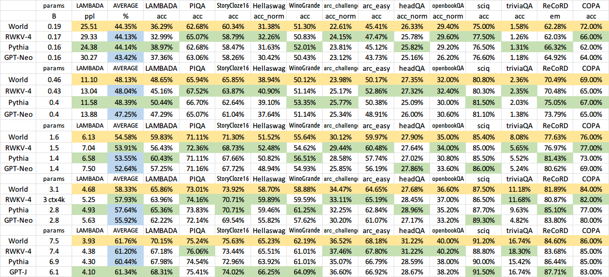

# ChatRWKV (pronounced as "RwaKuv", from 4 major params: R W K V)
ChatRWKV is like ChatGPT but powered by my RWKV (100% RNN) language model, which is the only RNN (as of now) that can match transformers in quality and scaling, while being faster and saves VRAM. Training sponsored by Stability EleutherAI :) **中文使用教程，请往下看，在本页面底部。**

**Raven 14B** (finetuned on Alpaca+ShareGPT+...) Demo: https://huggingface.co/spaces/BlinkDL/ChatRWKV-gradio

**Raven 7B** (finetuned on Alpaca+ShareGPT+...) Demo: https://huggingface.co/spaces/BlinkDL/Raven-RWKV-7B

**Download RWKV-4 weights:** https://huggingface.co/BlinkDL (**Use RWKV-4 models**. DO NOT use RWKV-4a and RWKV-4b models.)

Use v2/convert_model.py to convert a model for a strategy, for faster loading & saves CPU RAM.

Note RWKV_CUDA_ON will build a CUDA kernel (much faster & saves VRAM). Here is how to build it ("pip install ninja" first):
```
# How to build in Linux: set these and run v2/chat.py
export PATH=/usr/local/cuda/bin:$PATH
export LD_LIBRARY_PATH=/usr/local/cuda/lib64:$LD_LIBRARY_PATH
# How to build in win:
Install VS2022 build tools (https://aka.ms/vs/17/release/vs_BuildTools.exe select Desktop C++). Reinstall CUDA 11.7 (install VC++ extensions). Run v2/chat.py in "x64 native tools command prompt". 
```
**RWKV pip package**: https://pypi.org/project/rwkv/ **(please always check for latest version and upgrade)**

**Raven Q&A demo script:** https://github.com/BlinkDL/ChatRWKV/blob/main/v2/benchmark_more.py


## RWKV Discord: https://discord.gg/bDSBUMeFpc (let's build together)

**Twitter:** https://twitter.com/BlinkDL_AI

**RWKV LM:** https://github.com/BlinkDL/RWKV-LM (explanation, fine-tuning, training, etc.)

**RWKV in 150 lines** (model, inference, text generation): https://github.com/BlinkDL/ChatRWKV/blob/main/RWKV_in_150_lines.py

**Building your own RWKV inference engine:** begin with https://github.com/BlinkDL/ChatRWKV/blob/main/src/model_run.py which is easier to understand (used by https://github.com/BlinkDL/ChatRWKV/blob/main/chat.py).

**Cool Community RWKV Projects**:

https://github.com/saharNooby/rwkv.cpp INT4 INT8 FP16 FP32 inference for CPU using [ggml](https://github.com/ggerganov/ggml)

https://github.com/harrisonvanderbyl/rwkv-cpp-cuda pure CUDA RWKV (no need for python & pytorch)

https://github.com/Blealtan/RWKV-LM-LoRA LoRA fine-tuning

More RWKV projects: https://github.com/search?o=desc&q=rwkv&s=updated&type=Repositories

ChatRWKV v2: with "stream" and "split" strategies, and INT8. 3G VRAM is enough to run RWKV 14B :) https://github.com/BlinkDL/ChatRWKV/tree/main/v2
```python
os.environ["RWKV_JIT_ON"] = '1'
os.environ["RWKV_CUDA_ON"] = '0' # if '1' then use CUDA kernel for seq mode (much faster)
from rwkv.model import RWKV                         # pip install rwkv
model = RWKV(model='/fsx/BlinkDL/HF-MODEL/rwkv-4-pile-1b5/RWKV-4-Pile-1B5-20220903-8040', strategy='cuda fp16')

out, state = model.forward([187, 510, 1563, 310, 247], None)   # use 20B_tokenizer.json
print(out.detach().cpu().numpy())                   # get logits
out, state = model.forward([187, 510], None)
out, state = model.forward([1563], state)           # RNN has state (use deepcopy if you want to clone it)
out, state = model.forward([310, 247], state)
print(out.detach().cpu().numpy())                   # same result as above
```


Here is https://huggingface.co/BlinkDL/rwkv-4-raven/blob/main/RWKV-4-Raven-14B-v7-Eng-20230404-ctx4096.pth in action:


When you build a RWKV chatbot, always check the text corresponding to the state, in order to prevent bugs.

1. Never call raw forward() directly. Instead, put it in a function that will record the text corresponding to the state.

2. The best chat format (check whether your text is of this format):
```Bob: xxxxxxxxxxxxxxxxxx\n\nAlice: xxxxxxxxxxxxx\n\nBob: xxxxxxxxxxxxxxxx\n\nAlice:```

* There should not be any space after the final "Alice:". The generation result will have a space in the beginning, and you can simply strip it.
* You can use \n in xxxxx, but avoid \n\n. So simply do ```xxxxx = xxxxx.strip().replace('\r\n','\n').replace('\n\n','\n')```

The lastest "Raven"-series Alpaca-style-tuned RWKV 14B & 7B models are very good (almost ChatGPT-like, good at multiround chat too). Download: https://huggingface.co/BlinkDL/rwkv-4-raven

Previous old model results:


## 中文模型

QQ群 553456870（加入时请简单自我介绍）。有研发能力的朋友加群 325154699。

中文使用教程：https://zhuanlan.zhihu.com/p/618011122 https://zhuanlan.zhihu.com/p/616351661

推荐UI：https://github.com/l15y/wenda

## Star History

[](https://star-history.com/#BlinkDL/ChatRWKV&Date)
